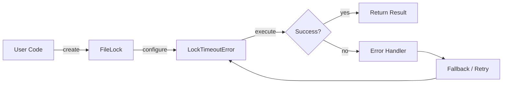
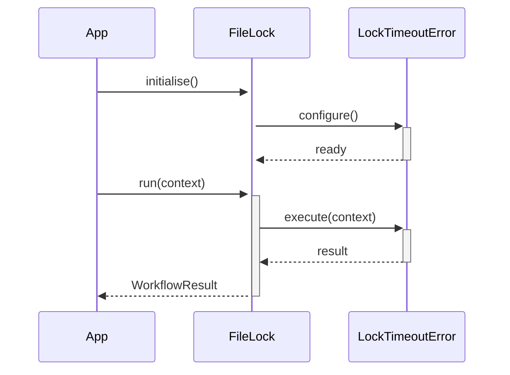

<div align="center">

</div>

# agent-lock

**Distributed locking for multi-agent shared resource access**

[](https://pypi.org/project/agent-lock/) [](https://python.org) [](LICENSE) [](#)

---

## The Problem

Without distributed locks, concurrent agents race to modify shared state — double-spending tokens, corrupting queues, or triggering duplicate tool calls. Correctness under concurrency is not accidental.

## Installation

```bash
pip install agent-lock
```

## Quick Start

```python
from agent_lock import FileLock, LockTimeoutError, Lock

# Initialise
instance = FileLock(name="my_agent")

# Use
# see API reference below
print(result)
```

## API Reference

### `FileLock`

```python
class FileLock:
    """File-system lock using atomic file creation for cross-process safety.
    def __init__(self, filepath: str, timeout_seconds: float = 10.0):
    def _write_lockfile_atomic(self) -> bool:
        """Atomically create lockfile with current PID. Returns True if successful."""
    def _read_lockfile_pid(self) -> Optional[int]:
        """Read PID from existing lockfile. Returns None if unreadable."""
    def _is_pid_alive(self, pid: int) -> bool:
        """Check if a process with given PID is alive."""
```

### `LockTimeoutError`

```python
class LockTimeoutError(Exception):
    """Raised when a lock cannot be acquired within the timeout period."""
    def __init__(self, name: str, timeout: float):
```

### `Lock`

```python
class LockTimeoutError(Exception):
    """Raised when a lock cannot be acquired within the timeout period."""
    def __init__(self, name: str, timeout: float):
class Lock:
    def __init__(self, name: str, timeout_seconds: float = 10.0):
    def acquire(self, timeout: Optional[float] = None) -> bool:
        """Acquire the lock. Returns False if timeout exceeded."""
    def release(self):
        """Release the lock."""
```


## How It Works

### Flow



### Sequence



## Philosophy

> *Ekāgratā* — single-pointed focus — is the lock that prevents distraction from entering the critical section.

---

*Part of the [arsenal](https://github.com/darshjme/arsenal) — production stack for LLM agents.*

*Built by [Darshankumar Joshi](https://github.com/darshjme), Gujarat, India.*
